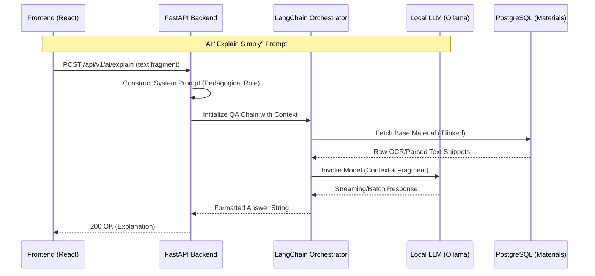

# EduNexus 2.0 AI System pipeline

The EduNexus AI framework seamlessly combines multiple deep learning models, external services, and sophisticated prompt engineering to construct an AI that operates simultaneously as an omniscient generalist and a deeply empathetic "Zero to Hero" personal tutor.

## 1. Core LLM Implementations (Groq)

### AI Request Lifecycle

The application natively ties into Groq, utilizing their lightning-fast LPU inference endpoints. A local fallback (`Ollama`) remains stubbed but inactive by default in production.

### **The Teaching Tutor (`llama-3.1-70b-versatile`)**
- **Purpose**: Implements the `Zero-to-Hero` teaching paradigm. High reasoning capacity.
- **Latency**: Output delays (1-3s) but exceptional semantic output.
- **Capabilities**: Socratic questioning, generating exhaustive markdown explanations, analogy integration mapping complex scientific logic to Nigerian daily life objects.
- **Dynamic Context Injection**: The backend dynamically embeds the currently requested student profile (age range, vocabulary level) inside the system prompt during an API call. For example, a "child" receives 1-2 sentence maximum replies utilizing emojis, while "teen/adult" receives more complex multi-sentence paragraphs.

### **The AI Generalist (`llama-3.1-8b-instant`)**
- **Purpose**: Rapid global presence, conversion routing, and basic chitchat.
- **Latency**: Sub-300ms, nearly instant WebSocket or HTTP delivery.
- **Restrictions**: `max_tokens=100`. The Generalist actively refuses deep conceptual education, instead recommending the user login to access the full platform.

## 2. Real-Time Lesson Coordination (`ai_coordinator.py`)

During a LiveKit session, real-time teacher audio is actively transcribed via **Whisper**.
1. **Audio Capture**: Browsers securely capture and sample microphone input, packaging it through LiveKit channels.
2. **STT Transcription**: The backend's Whisper bindings detect transcript content accurately.
3. **Complexity Evaluation**: The backend runs a fast heuristic/LLM check (`_analyze_complexity()`) to determine if the teacher just explained a difficult concept.
4. **Triggered Explanations**: If complexity crests a specific threshold, the AI Coordinator actively runs `generate_explanation()` synchronously alongside the live audio, producing highly customized study notes pushed to WebSockets instantaneously.

## 3. RAG/Material Integration Pipeline (Docling)
Users and Teachers possess the ability to upload proprietary documents to shape the bounds of an AI conversation.
- **Pipeline Structure**: IBM **Docling** asynchronously parses structurally chaotic Markdown, PDFs, and HTML.
- **Chunking Strategy**: Extracted text strips are semanticly clustered.
- **Metadata Association**: While pgvector handles vector embeddings in the full stack, Docling dynamically parses topics to store them contextually on the PostgreSQL `Material` definition directly.

## 4. Advanced System Prompts

EduNexus relies on carefully tuned behavioral rulesets injected invisibly preceding any message payload passed to Groq:
- **`ZERO-TO-HERO RULE`**: Always assume the student knows nothing entirely. Build up sequentially.
- **`TERMINOLOGY RULE`**: Explains a concept natively initially, introduces the bolded dictionary term, then enforces the usage.
- **`ANALOGY RULE`**: Requires an "Imagine..." scenario, enforcing diverse examples (computing, apps, sports) rather than localized tropes.
- **`NAME RULE`**: Interleaves the student's actual database profile First Name seamlessly into the dialog for a personal connection.

## 5. Energy-Based Rate Limiting ("Brain Power")

To ensure high-quality interactions and system sustainability, AI tutoring is governed by a gamified energy system:
- **Token Valuation**: Each AI assistant response costs **10 Brain Power** points.
- **State Management**: Energy levels are tracked per-student in the database and synchronized to the frontend dashboard.
- **Incentivized Review**: Students earn energy back by engaging in non-LLM activities, such as watching curated educational videos or achieving mastery in module tests.

## 6. Deterministic Evaluation (Mastery Testing)

While questions are generated by AI, the grading of "Mastery Tests" is performed via high-performance **rule-based logic** in the backend:
- **Performance**: Instantaneous feedback without LLM latency.
- **Reliability**: Deterministic scoring based on exact matching and pattern validation.
- **Mastery Thresholds**: Scores are utilized to compute "Knowledge Mastery" levels and trigger energy rewards.
