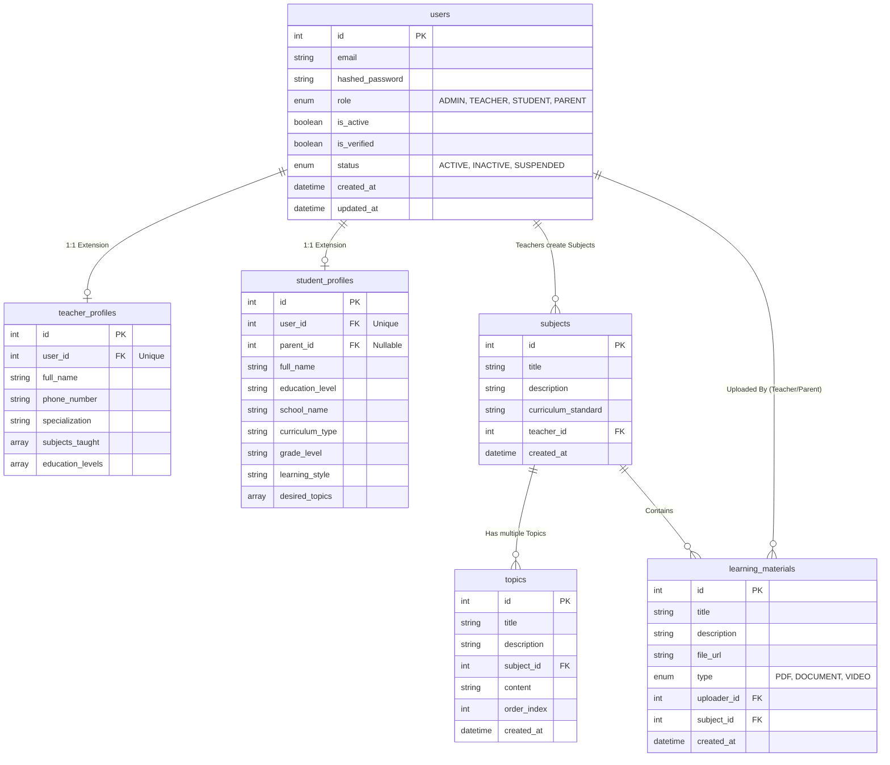

<!--  --># Backend Architecture

The EduNexus 2.0 backend is powered by **FastAPI** (Python 3.11), taking full advantage of modern asynchronous Python features for high performance and concurrency, crucial for real-time educational applications.

## 1. Tech Stack
- **Framework:** FastAPI, Uvicorn, Starlette
- **Language:** Python 3.11+
- **Database ORM:** SQLAlchemy 2.0 (PostgreSQL)
- **Data Validation:** Pydantic V2
- **Authentication:** Passlib (bcrypt), PyJWT, OAuth2
- **Cache & Message Broker:** Redis, Celery (background tasks)
- **Storage Connectivity:** Boto3 (AWS S3 SDK, interfacing with SeaweedFS)

## 2. Directory Structure (`backend/app/`)

```
backend/app/
├── api/
│   ├── dependencies.py       # Reusable auth/db injection (get_db, get_current_user)
│   └── v1/
│       ├── endpoints/        # Route controllers (auth, users, subjects, materials, ai, etc.)
│       └── router.py         # Main APIRouter consolidating endpoints
├── core/
│   ├── config.py             # Pydantic BaseSettings loading from .env
│   └── security.py           # JWT token generation, password hashing
├── db/
│   ├── database.py           # SQLAlchemy engine, SessionLocal, Base creation
│   └── models.py             # Single file or module mapping DB tables (Users, Materials)
├── models/                   # Split SQLAlchemy schema definitions (e.g. user.py, material.py) 
├── schemas/                  # Pydantic models (Input/Output validation)
├── services/
│   ├── ai_coordinator.py     # High-level orchestration of AI features
│   ├── llm_service.py        # Groq/Ollama API wrappers for completions
│   ├── livekit_service.py    # Room and Token management via LiveKit SDK
│   ├── parsing_service.py    # IBM Docling integration & background processing
│   └── storage_service.py    # S3 Client wrapper for SeaweedFS uploads/resolutions
└── main.py                   # FastAPI application initialization & CORS
```

## 3. Database & Models (SQLAlchemy + PostgreSQL)

### Entity-Relationship Diagram


### Table Definitions
EduNexus inherently heavily normalizes educational data:
- **`User` (Base):** Enum roles (`student`, `teacher`, `professional`, `admin`).
- **`StudentProfile` (1:1):** Contains VARK learning style assessments, adaptive proficiency scores.
- **`Subject` -> `Topic` -> `Subtopic`:** Hierarchical curriculum storage supporting privacy flags (`is_private`).
- **`Material`:** Uploaded PDFs and multimedia linked to a `Subject` with an array `allowed_students` column for Professional privacy rules. Postgres `ARRAY` columns are utilized efficiently.

## 4. Services Architecture

### **Auth System**
- JWT tokens with expiration buffers.
- Role-based Access Control via `Depends(require_role)`. For instance, materials can only be uploaded by robust users (`teacher`, `professional`).

### **Background Tasks (Celery + Redis)**
- Long-running operations like Docling PDF ingestion or engagement analytics calculation run completely out-of-band via Celery.
- Pydantic models are passed to workers asynchronously, allowing endpoints to instantly return a `202 Accepted` or `201 Created` without locking an ASGI thread.

### **WebSocket Manager**
- Located in `api/v1/endpoints/websocket.py` & `services/websocket_manager.py`.
- Maintains active dictionary of `ConnectionManager.active_connections`.
- Broadcasts JSON payloads indicating events like `student_raised_hand`, `engagement_update`, or `ai_explanation_generated` universally across connected room clients.

## 5. Middleware and CORS
- **CORS Configuration:** Extremely permissive for local development (`http://localhost:3000`, `http://localhost:5173`, `http://host.docker.internal:3000`).
- **Exception Handling:** Custom exception handlers override standard 500 behaviors to embed critical CORS headers, avoiding masked `Axios` generic errors on the frontend.
